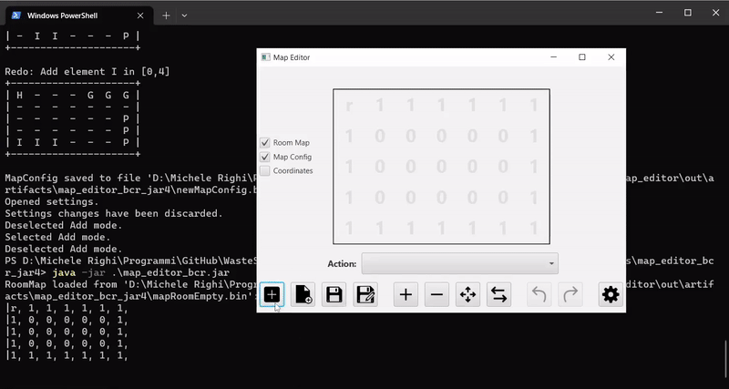

[![MIT License][license-shield]][license-url]
[![Size][size-shield]][size-url]
[![Issues][issues-shield]][issues-url]
[![Downloads][downloads-shield]][downloads-url]
[![Stars][stars-shield]][stars-url]\
[![Java][java-shield]][java-url]
[![Kotlin][kotlin-shield]][kotlin-url]
[![Flutter][flutter-shield]][flutter-url]
[![VS Code][vscode-shield]][vscode-url]
[![IntelliJ IDEA][intellij-shield]][intellij-url]

 

  
  
  <h1>WasteService</h1>
  
  Sistema software distribuito per un ***servizio di smaltimento rifiuti differenziato***. Il progetto è stato sviluppato per il corso di [Ingegneria dei Sistemi Software M](https://www.unibo.it/it/didattica/insegnamenti/insegnamento/2021/468003) dell'Università di Bologna, sfruttando il [framework agile SCRUM](https://www.scrum.org/resources/what-is-scrum).
  
  [Documenti di Progetto](https://htmlpreview.github.io/?https://raw.githubusercontent.com/iss2022-BCR/WasteService/main/Sprint0/index.html)
  ·
  [Presentazione](./commons/presentation/WasteServiceBCR_IT.pdf)
  ·
  [Guida SCRUM](./commons/2020-Scrum-Guide-Italian.pdf)
  ·
  [English <kbd></kbd>](./README.md)
  

## Il Progetto

  
	 
	Video dimostrativo completo

### Componenti
Il progetto consiste nei seguenti elementi:
<table>
  <tr align="center">
    <th width="15%">Nome</th>
    <th width="35%">Descrizione</th>
    <th width="50%">Demo</th>
  </tr>
  <tr align="center">
    <td><b>Smart&nbsp;Device</b></td>
    <td>
	    Applicazione mobile che permette all'autista di un <i>Waste Truck driver</i> di <b>inviare una <i>StoreRequest</i></b> al Waste Service, specificando la quantità (kg) e il tipo (vetro o plastica) di rifiuti che vuole depositare.
    </td>
    <td></td>
  </tr>
  <tr align="center">
    <td><b>Virtual&nbsp;Robot</b></td>
    <td>
			Applicazione web, fornita dal committente, che simula un Robot. Il robot è confinato in un <b>ambiente virtuale</b> (una stanza rettangolare) e può <b>ricevere comandi per eseguire delle azioni</b>, ad esempio muoversi in avanti o indietro per una certa durata o muovendosi a passi (pari alla lunghezza del robot), e ruotare.
    </td>
    <td></td>
  </tr>
  <tr align="center">
    <td><b>Mapper&nbsp;QAK22</b></td>
    <td>
      Software, fornito dal committente, che sfrutta le funzionalità di un Planner per mappare la stanza in cui il robot si trova (muovendosi a step), e restituendo una <b>rappresentazione a griglia in un file</b>;
    </td>
    <td></td>
  </tr>
  <tr align="center">
    <td><b>Map&nbsp;Editor</b></td>
    <td>
      Applicazione grafica per desktop, che permette di caricare la rappresentazione di un stanza e di creare un <b>file di configurazione della stanza</b>, tramite drag & drop di particolari celle (<i>Home</i>, <i>Indoor</i>, <i>PlasticBox</i>, ecc.)
    </td>
    <td></td>
  </tr>
  <tr align="center">
    <td><b>Waste&nbsp;Service&nbsp;Core</b></td>
    <td>
			Componente principale del sistema. Carica una configurazione della stanza e si occupa della <b>gestione del Waste Service</b>. Riceve Store Request dagli Smart Device, le processa e delega un <i>Transport Trolley</i> per raccogliere il carico e depositare i rifiuti, nel caso ci sia abbastanza spazio nel container richiesto.
		</td>
    <td></td>
  </tr>
  <tr align="center">
    <td><b>Waste&nbsp;Service&nbsp;RPi</b></td>
    <td>
			Componente che può eseguire su un Raspberry Pi o su un nodo desktop (in modalità simulata). Implementa un <b>dispositivo di avvertimento/allarme</b>: quando un sonar a ultrasuoni (o un qualche dispositivo che produce una distanza, ad esempio il simulatore) rileva una distanza minore o maggiore di una soglia, invia un evento al sistema, che stoppa/ripristina l'attività del Transport Trolley; Waste Service RPi mostra anche informazioni sullo stato corrente del sistema, tramite altri componenti (led, buzzer, display LCD).
		</td>
    <td></td>
  </tr>
  <tr align="center">
    <td><b>Waste&nbsp;Service&nbsp;GUI</b></td>
    <td>
			Applicazione web per <b>supervisionare lo stato del Waste Service</b>. Visualizza ogni informazione utile riguardante lo stato corrente del sistema, inclusa una rappresentazione dell'area di servizio e la posizione del robot all'interno di essa.
		</td>
    <td></td>
  </tr>
</table>

### Roadmap
- [x] **Sprint0** - System Base Requirement Analysis
  - Ultima Release: [Sprint0 v2](https://github.com/iss2022-BCR/WasteService/releases/tag/sprint0_v2)
  - Sprint Review: 08/09/22 16:30
- [x] **Sprint1** - WasteService Core-Business
  - Ultima Release: [Sprint1 v3](https://github.com/iss2022-BCR/WasteService/releases/tag/sprint1_v3)
  - Sprint Review: 25/11/22 10:30
- [X] **Sprint2** - Raspberry Pi
  - Ultima Release: [Sprint2 v1](https://github.com/iss2022-BCR/WasteService/releases/tag/sprint2_v1)
  - Sprint Review: 14/04/22 16:30
- [x] **Sprint3** - Monitoring
  - Ultima Release: [WasteService](https://github.com/iss2022-BCR/WasteService/releases/latest)
  - Esame Finale: 27/04/22 11:00 

<!--
### Competenze Acquisite
- SCRUM/Agile
[...]
-->

## Team
<table>
  <!--<tr align="center"><td colspan="3"><b>Team BCR</b></td></tr>-->
  <tr align="center">
    <td></td>
    <td></td>
    <td></td>
  </tr>
  <tr align="center">
    <td><b>Raffaele Battipaglia</b></td>
    <td><b>Karina Chichifoi</b></td>
    <td><b>Michele Righi</b></td>
  </tr>
</table>

[java-shield]: https://custom-icon-badges.herokuapp.com/badge/Java-ED8B00?logo=java&logoColor=white
[java-url]: https://www.java.com
[kotlin-shield]: https://img.shields.io/badge/Kotlin-%237F52FF.svg?logo=kotlin&logoColor=white
[kotlin-url]: https://kotlinlang.org/
[flutter-shield]: https://img.shields.io/badge/Flutter-%2302569B.svg?logo=Flutter&logoColor=white
[flutter-url]: https://flutter.dev/
[vscode-shield]: https://img.shields.io/badge/Visual%20Studio%20Code-0078d7.svg?logo=visual-studio-code&logoColor=white
[vscode-url]: https://code.visualstudio.com/
[intellij-shield]: https://img.shields.io/badge/IntelliJ%20IDEA-000000.svg?logo=intellij-idea&logoColor=blue
[intellij-url]: https://www.jetbrains.com/idea/ 
[downloads-shield]: https://img.shields.io/github/downloads/iss2022-BCR/WasteService/total
[downloads-url]: https://github.com/iss2022-BCR/WasteService/releases/latest
[license-shield]: https://img.shields.io/github/license/iss2022-BCR/WasteService
[license-url]: https://github.com/iss2022-BCR/WasteService/blob/main/LICENSE
[size-shield]: 	https://img.shields.io/github/repo-size/iss2022-BCR/WasteService
[size-url]: https://github.com/iss2022-BCR/WasteService
[issues-shield]: https://img.shields.io/github/issues/iss2022-BCR/WasteService
[issues-url]: https://github.com/iss2022-BCR/WasteService/issues
[stars-shield]: https://img.shields.io/github/stars/iss2022-BCR/WasteService?logo=star&logoColor=yellow&style=flat
[stars-url]: https://github.com/iss2022-BCR/WasteService/stargazers
