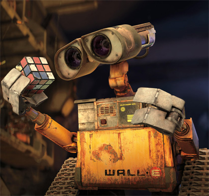

[![MIT License][license-shield]][license-url]
[![Size][size-shield]][size-url]
[![Issues][issues-shield]][issues-url]
[![Downloads][downloads-shield]][downloads-url]
[![Stars][stars-shield]][stars-url]\
[![Java][java-shield]][java-url]
[![Kotlin][kotlin-shield]][kotlin-url]
[![Flutter][flutter-shield]][flutter-url]
[![VS Code][vscode-shield]][vscode-url]
[![IntelliJ IDEA][intellij-shield]][intellij-url]

 

  
  
  <h1>WasteService</h1>
  
  Distributed software system for a ***differentiated waste disposal service***. The project had been developed for the course of [Software Systems Engineering M](https://www.unibo.it/en/teaching/course-unit-catalogue/course-unit/2021/468003) of the University of Bologna, using the [SCRUM agile framework](https://www.scrum.org/resources/what-is-scrum).
  
  [Project documents](https://htmlpreview.github.io/?https://raw.githubusercontent.com/iss2022-BCR/WasteService/main/Sprint0/index.html)
  ·
  [Presentation](./commons/presentation/WasteServiceBCR.pdf)
  ·
  [SCRUM Guide](./commons/2020-Scrum-Guide-US.pdf)
  ·
  [Italiano <kbd></kbd>](./README.it.md)
  

## About the Project

  
	 
	Complete demo video

### Components
The project consists of different elements:
<table>
  <tr align="center">
    <th width="15%">Name</th>
    <th width="35%">Description</th>
    <th width="50%">Demo</th>
  </tr>
  <tr align="center">
    <td><b>Smart&nbsp;Device</b></td>
    <td>
      Mobile application that allows a <i>Waste Truck driver</i> to <b>send a <i>StoreRequest</i></b> to the Waste Service, specifying the X amount (kg) of Y type (glass or plastic) of waste they want to deposit.
    </td>
    <td></td>
  </tr>
  <tr align="center">
    <td><b>Virtual&nbsp;Robot</b></td>
    <td>
      Web application provided by the customer that simulates a Robot. The robot is confined in a <b>virtual environment</b> (a rectangular room) and can <b>receive commands to perform some actions</b>, such as moving forward/backwards both for a certain amount of time or by steps equal to its length, and to rotate.
    </td>
    <td></td>
  </tr>
  <tr align="center">
    <td><b>Mapper&nbsp;QAK22</b></td>
    <td>
      Software provided by the customer that exploits Planner functions to map the room in which the robot is located (moving it by steps), and outputs a <b>grid representation file</b>;
    </td>
    <td></td>
  </tr>
  <tr align="center">
    <td><b>Map&nbsp;Editor</b></td>
    <td>
      Desktop graphical application that allows the user to load a map representation and to create a <b>map configuration file</b> by dragging and dropping the room tiles (<i>Home</i>, <i>Indoor</i>, <i>PlasticBox</i>, etc.)
    </td>
    <td></td>
  </tr>
  <tr align="center">
    <td><b>Waste&nbsp;Service&nbsp;Core</b></td>
    <td>
			Main component of the system. It loads a map configuration and <b>manages the Waste Service</b>. It receives Store Requests from the Smart Devices, process them and delegates a <i>Transport Trolley</i> for the waste pick up and dump, in case there is enough space in the requested container.
		</td>
    <td></td>
  </tr>
  <tr align="center">
    <td><b>Waste&nbsp;Service&nbsp;RPi</b></td>
    <td>
			Component that can run on a Raspberry Pi or on a desktop node (simulated). It implements an <b>alarm/warning device</b>: when a ultrasonic sonar (or some distance provider, e.g. the simulator) detects a distance that is lower/greater than a threshold, it sends an event to the system, that will stop/resume the Transport Trolley activity; Waste Service RPi also shows information about the system current state through other components (led, buzzer, LCD display).
		</td>
    <td></td>
  </tr>
  <tr align="center">
    <td><b>Waste&nbsp;Service&nbsp;GUI</b></td>
    <td>
			Web application to <b>monitor the Waste Service status</b>. It displays any useful information about the current state of the system, including a representation of the Waste Area and the robot position inside of it.
		</td>
    <td></td>
  </tr>
</table>
  
### Roadmap
- [x] **Sprint0** - System Base Requirement Analysis
  - Latest Release: [Sprint0 v2](https://github.com/iss2022-BCR/WasteService/releases/tag/sprint0_v2)
  - Sprint Review: 08/09/22 16:30
- [x] **Sprint1** - WasteService Core-Business
  - Latest Release: [Sprint1 v3](https://github.com/iss2022-BCR/WasteService/releases/tag/sprint1_v3)
  - Sprint Review: 25/11/22 10:30
- [x] **Sprint2** - Raspberry Pi
  - Latest Release: [Sprint2 v1](https://github.com/iss2022-BCR/WasteService/releases/tag/sprint2_v1)
  - Sprint Review: 14/04/22 16:30
- [x] **Sprint3** - Monitoring
  - Latest Release: [WasteService](https://github.com/iss2022-BCR/WasteService/releases/latest)
  - Final Exam: 27/04/22 11:00

## Team
<table>
  <!--<tr align="center"><td colspan="3"><b>Team BCR</b></td></tr>-->
  <tr align="center">
    <td></td>
    <td></td>
    <td></td>
  </tr>
  <tr align="center">
    <td><b>Raffaele Battipaglia</b></td>
    <td><b>Karina Chichifoi</b></td>
    <td><b>Michele Righi</b></td>
  </tr>
</table>

[java-shield]: https://custom-icon-badges.herokuapp.com/badge/Java-ED8B00?logo=java&logoColor=white
[java-url]: https://www.java.com
[kotlin-shield]: https://img.shields.io/badge/kotlin-%237F52FF.svg?logo=kotlin&logoColor=white
[kotlin-url]: https://kotlinlang.org/
[flutter-shield]: https://img.shields.io/badge/Flutter-%2302569B.svg?logo=Flutter&logoColor=white
[flutter-url]: https://flutter.dev/
[vscode-shield]: https://img.shields.io/badge/Visual%20Studio%20Code-0078d7.svg?logo=visual-studio-code&logoColor=white
[vscode-url]: https://code.visualstudio.com/
[intellij-shield]: https://img.shields.io/badge/IntelliJ%20IDEA-000000.svg?logo=intellij-idea&logoColor=blue
[intellij-url]: https://www.jetbrains.com/idea/ 
[downloads-shield]: https://img.shields.io/github/downloads/iss2022-BCR/WasteService/total
[downloads-url]: https://github.com/iss2022-BCR/WasteService/releases/latest
[license-shield]: https://img.shields.io/github/license/iss2022-BCR/WasteService
[license-url]: https://github.com/iss2022-BCR/WasteService/blob/main/LICENSE
[size-shield]: 	https://img.shields.io/github/repo-size/iss2022-BCR/WasteService
[size-url]: https://github.com/iss2022-BCR/WasteService
[issues-shield]: https://img.shields.io/github/issues/iss2022-BCR/WasteService
[issues-url]: https://github.com/iss2022-BCR/WasteService/issues
[stars-shield]: https://custom-icon-badges.herokuapp.com/github/stars/iss2022-BCR/WasteService?logo=star&logoColor=yellow&style=flat
[stars-url]: https://github.com/iss2022-BCR/WasteService/stargazers
